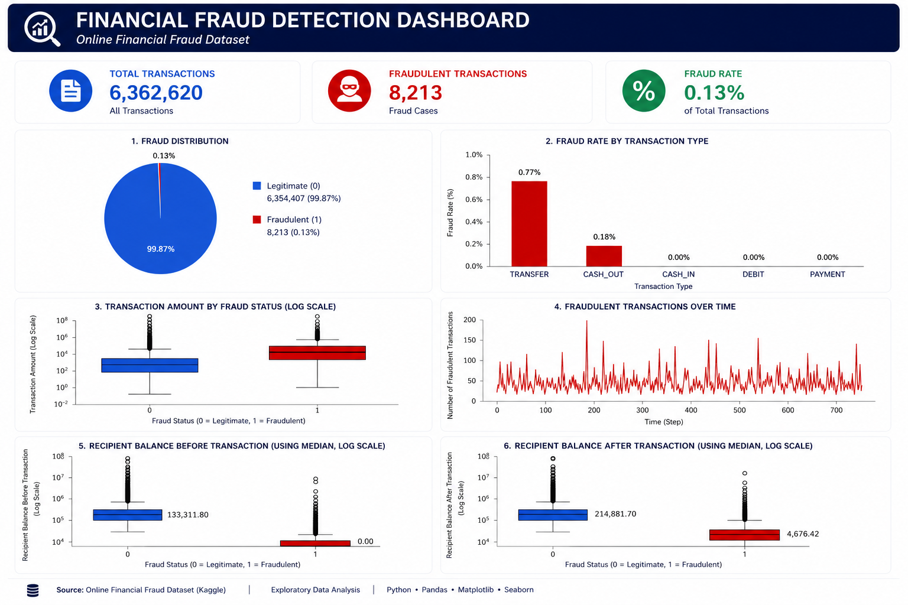
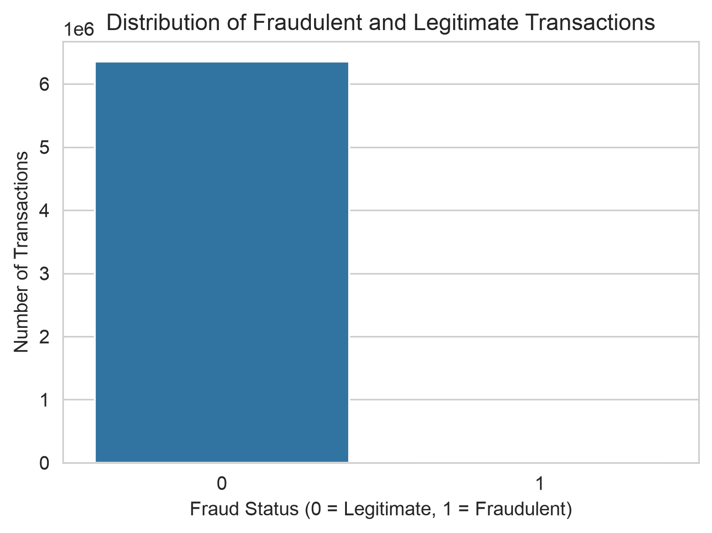

# Financial Fraud Detection: Exploratory Data Analysis

## Project Overview

Financial fraud is a major challenge for banks and payment platforms, resulting in significant financial losses each year. Detecting fraudulent transactions early is essential for protecting customers and maintaining trust in financial systems.

This project performs an exploratory data analysis (EDA) on an online financial transaction dataset to understand the characteristics of fraudulent transactions and identify patterns that can support the development of fraud detection models.

The insights gained from this analysis will serve as the foundation for future machine learning models capable of detecting fraudulent transactions.



---

## Business Problem

Banks process millions of transactions every day, making manual fraud detection impossible.

This project answers the following business questions:

- How common is fraud?
- Which transaction types are most vulnerable?
- Do fraudulent transactions involve larger amounts?
- How do sender and recipient account balances differ?
- Does fraud occur at specific times or throughout the day?

Answering these questions helps identify important features for fraud detection systems.

---

## Dataset

The dataset contains simulated online financial transactions with labelled fraudulent and legitimate transactions.
View dataset https://www.kaggle.com/datasets/jainilcoder/online-payment-fraud-detection

### Features

- step
- type
- amount
- oldbalanceOrg
- newbalanceOrig
- oldbalanceDest
- newbalanceDest
- isFraud
- isFlaggedFraud

### Dataset Summary

| Metric | Value |
|---------|-------:|
| Transactions | 6,362,620 |
| Features | 11 |
| Fraudulent Transactions | 8,213 |
| Legitimate Transactions | 6,354,407 |
| Fraud Percentage | 0.13% |

---

## Project Structure

```
Fraud_Detection_Project/
│
├── data/
│   ├── raw/
│   └── processed/
│
├── notebooks/
│   ├── 01_data_cleaning.ipynb
│   └── 02_exploratory_data_analysis.ipynb
│
├── images/
│
├── README.md
├── requirements.txt
└── .gitignore
```

---

## Technologies Used

- Python
- Pandas
- NumPy
- Matplotlib
- Seaborn
- Jupyter Notebook
- Visual Studio Code

---

## Data Cleaning

Before analysis, the dataset was cleaned by:

- Checking for missing values
- Checking for duplicate records
- Verifying data types
- Checking for invalid balance values
- Identifying zero-value transactions
- Saving the cleaned dataset for analysis

---

## Exploratory Data Analysis

The analysis focused on answering five key business questions.

### 1. How common is fraud?



Fraud accounts for only **0.13%** of all transactions, indicating a highly imbalanced dataset.

---

### 2. Which transaction types are most vulnerable?


Fraud occurs exclusively in **TRANSFER** and **CASH_OUT** transactions.

TRANSFER has the highest fraud rate despite CASH_OUT containing slightly more fraud cases.

---

### 3. Do fraudulent transactions involve larger amounts?


Fraudulent transactions generally involve significantly larger transaction amounts than legitimate transactions.

However, transaction amount alone is insufficient for identifying fraud because both groups contain extreme outliers.

---

### 4. How do account balances differ?


Fraudulent transactions typically:

- originate from accounts with higher sender balances
- leave sender accounts with very low remaining balances
- involve recipient accounts with little or no balance before receiving funds

These balance patterns provide useful indicators for fraud detection.

---

### 5. Does fraud change over time?


Fraud occurs throughout the observation period with occasional spikes but no consistent upward or downward trend.

This suggests that fraud detection systems should monitor transactions continuously.

---

## Key Findings

- Fraud represents only **0.13%** of all transactions.
- Fraud occurs only in TRANSFER and CASH_OUT transactions.
- TRANSFER has the highest fraud rate.
- Fraudulent transactions generally involve larger transaction amounts.
- Sender account balances are typically higher before fraudulent transactions.
- Recipient accounts involved in fraud often have very low initial balances.
- Fraud occurs consistently throughout the observation period.

---

## Business Recommendations

Based on the findings, financial institutions should:

- Monitor TRANSFER and CASH_OUT transactions more closely.
- Apply additional verification to high-value transactions.
- Detect unusual sender and recipient balance patterns.
- Operate fraud monitoring systems continuously.
- Combine multiple transaction features when building fraud detection models.

---

## Author

**Peace Nwana**

I am a certified IBM data analyst | AWS Cloud Practitioner.
I use data analysis to understand patterns, behaviour, and real-world problems.


GitHub: *(https://github.com/nwana-peace)*

Medium: *(https://medium.com/@nwanapeace12)*
